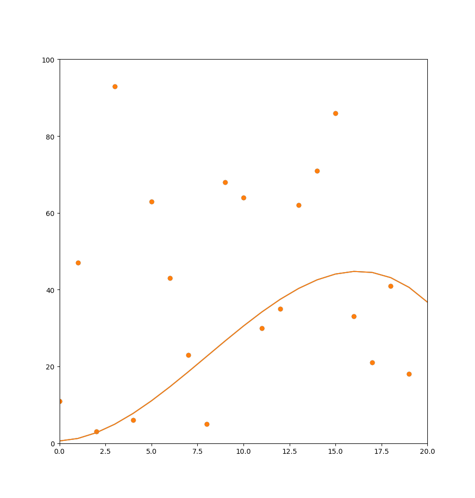
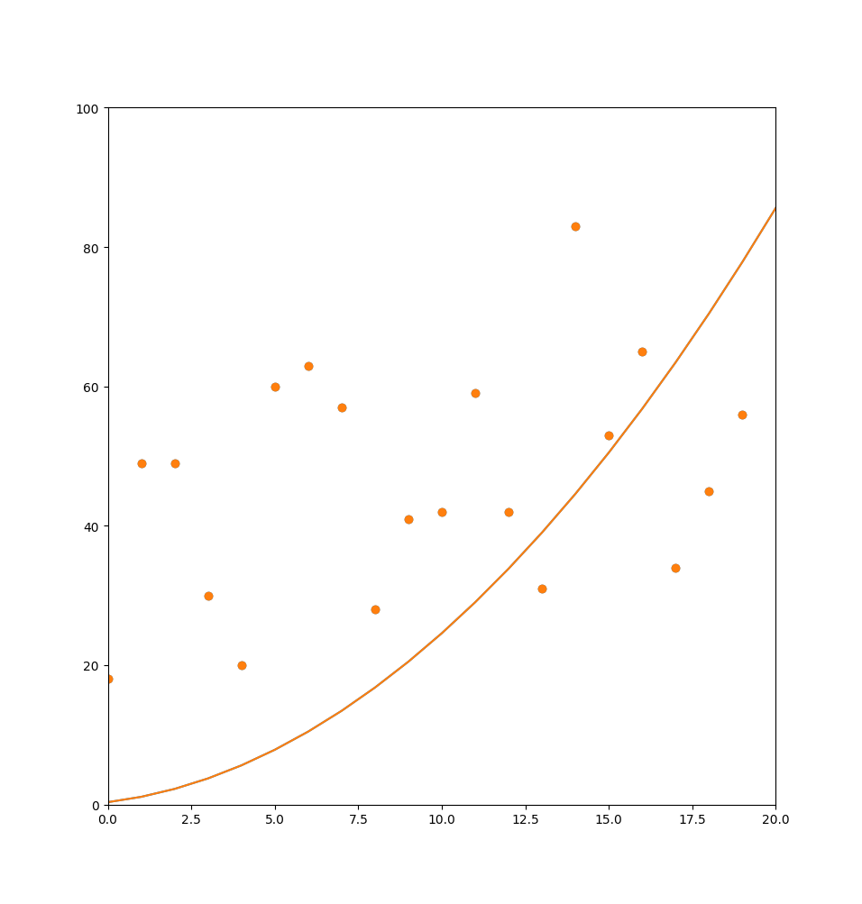
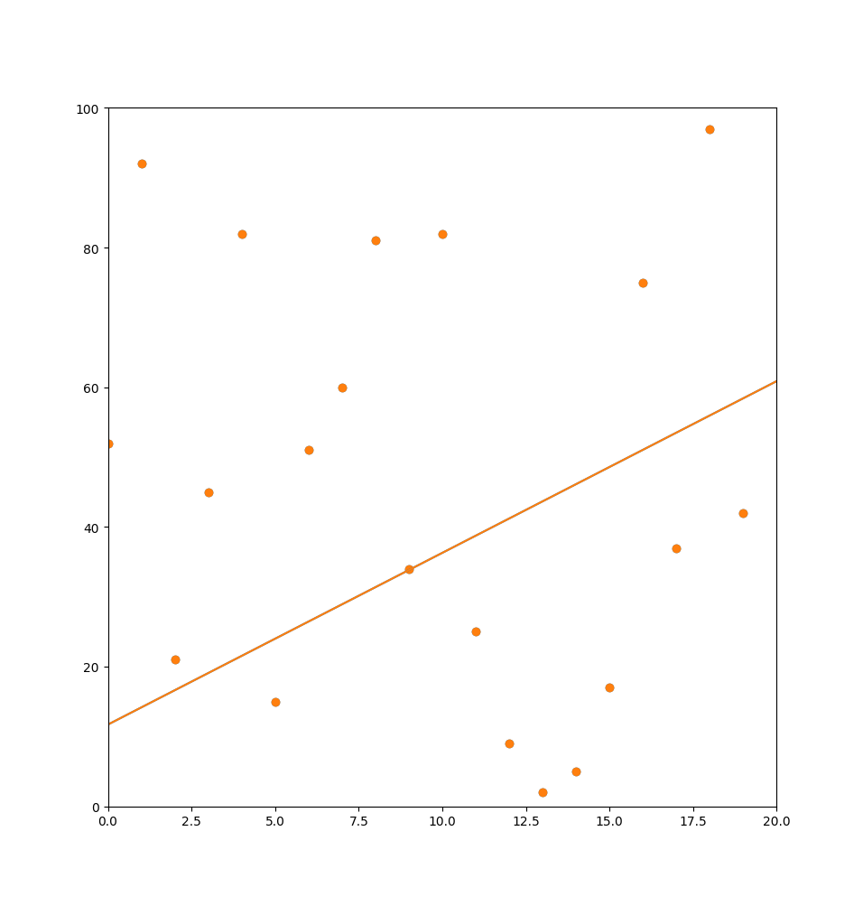

# Week 2

## Multivariate Gradient Descent
Edit the gradientDescent.py file to modify the degree, number of points, and learning rate for the program

### Cubic (degree 3)

### Quadratic (degree 2)

### Linear (degree 1)

